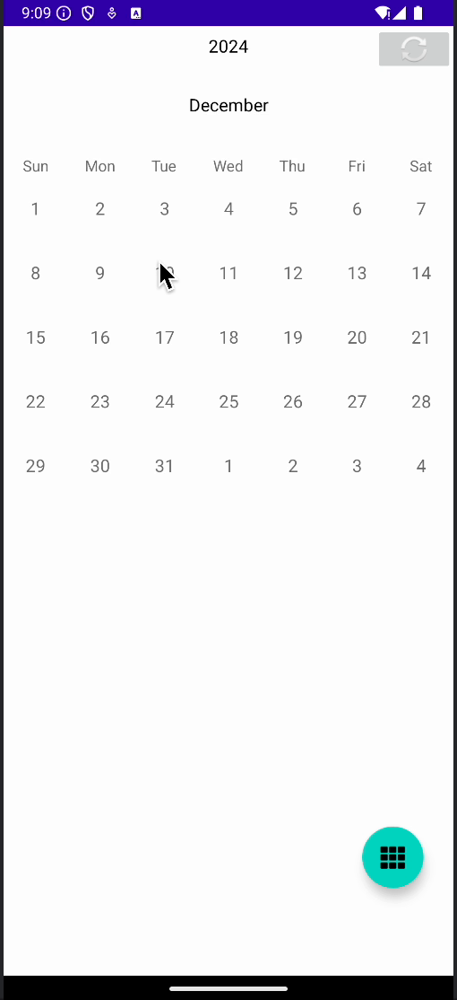
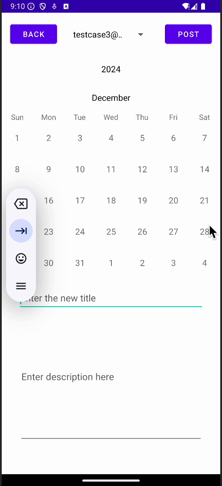
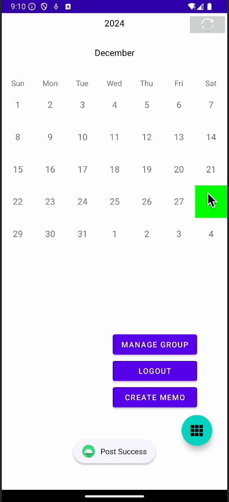
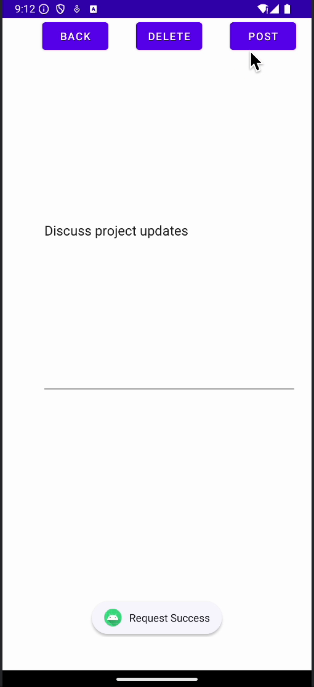

# Group Calendar Memo

This application was developed as a two-person course project for
Distributed and Networked Operating Systems. I owned the complete native
Android client, while my teammate developed the backend service.

My work included authentication, calendar and event workflows, group
collaboration, memos, REST API integration, JWT session handling, and
real-time client-server communication.

## Demo

The following walkthrough demonstrates the Android client's authentication,
calendar, event-management, and memo workflows.

▶️ [Watch the 27-second application demo](assets/calendar-memo-highlights.mp4)

<table>
  <tr>
    <td align="center">
      
      <br>
      <strong>Calendar Home</strong>
    </td>
    <td align="center">
      
      <br>
      <strong>Create Event</strong>
    </td>
  </tr>
  <tr>
    <td align="center">
      
      <br>
      <strong>Event Details</strong>
    </td>
    <td align="center">
      
      <br>
      <strong>Edit Memo</strong>
    </td>
  </tr>
</table>

### Demonstrated workflows

- User registration and authentication
- Monthly calendar navigation
- Date selection
- Event creation, viewing, editing, and deletion
- Memo creation, editing, and deletion
- Access to group-management functionality
- Authenticated logout

## Overview

Group Calendar Memo allows users to organize events and notes within shared
groups. The Android client communicates with a separate backend through REST
APIs and maintains real-time communication for collaborative features.

The project demonstrates native Android development, client-server
communication, authentication, state management, and integration with a
third-party calendar UI component.

## Features

### Authentication

- Create a new user account
- Log in to an existing account
- Maintain authenticated sessions using JWT-based authentication
- Store and reuse authentication information between app sessions

### Calendar and Events

- Browse events through a monthly calendar interface
- View events associated with a selected date
- Create, update, and delete calendar events
- Display event details in an organized list
- Associate events with shared groups

### Group Collaboration

- Create and manage user groups
- Add or remove group members
- Share calendar events with group members
- Access group-specific events and information

### Memos

- Create and view memos
- Share memos with members of a group
- Organize notes alongside calendar information

### Notifications and Communication

- Display application and group notifications
- Receive updates from the backend
- Support real-time communication through WebSocket connections
- Synchronize client data with the server through REST APIs

## Technical Highlights

- Built the complete Android client using Java
- Designed the application's screens, navigation flows, and user interactions
- Integrated the Kizitonwose CalendarView library and customized it for events
  selection and display
- Connected the application to a Node.js/Express backend through REST APIs
- Implemented authentication flows and token-based session persistence
- Managed asynchronous network operations without blocking the Android UI
- Implemented real-time client-server communication
- Connected calendar selections with dynamically updated event lists
- Tested the application using Android emulators and physical devices

## Architecture

```text
┌──────────────────────────────┐
│       Android Client         │
│                              │
│  Authentication              │
│  Calendar and Events         │
│  Groups and Memos            │
│  Notifications               │
└──────────────┬───────────────┘
               │
               │ REST APIs / WebSocket
               │
┌──────────────▼───────────────┐
│       Backend Service        │
│                              │
│  Authentication              │
│  Business Logic              │
│  Data Persistence            │
└──────────────────────────────┘
```

## Running the Project

### Requirements

- Android Studio
- Android SDK 26 or later
- Java 11
- Android emulator or physical device
- A compatible backend service

### Configuration

The original backend was developed separately by my teammate and is not
included in this public repository.

To connect the Android client to another compatible backend, update the
server addresses in:

```text
app/src/main/java/com/coms5540/calendarmemo/Utilities/Variable.java
